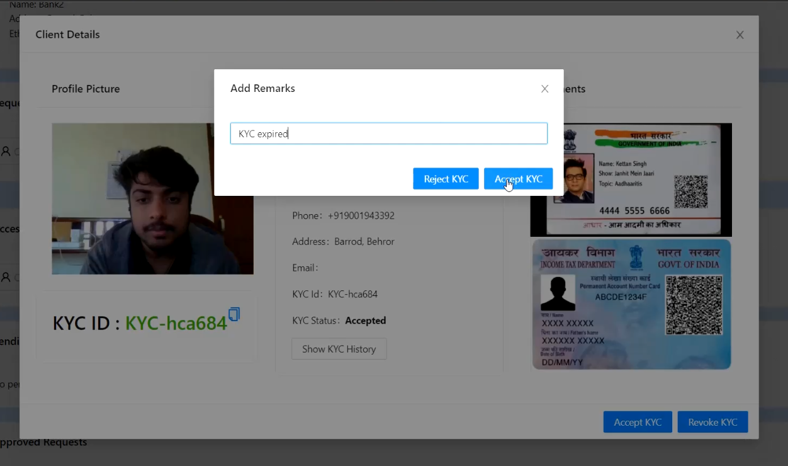
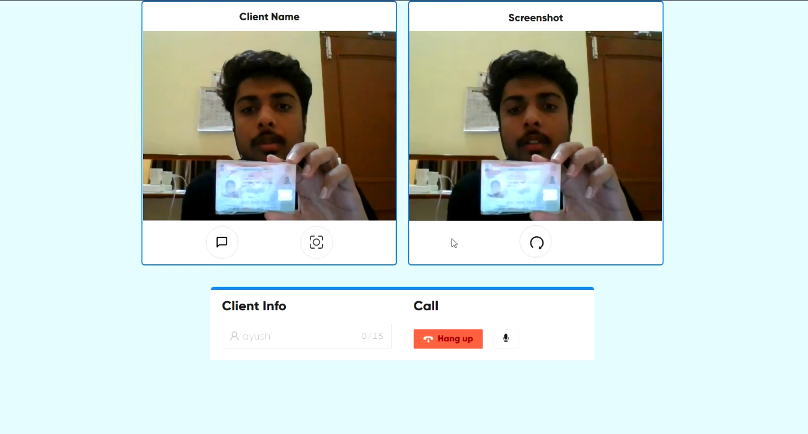
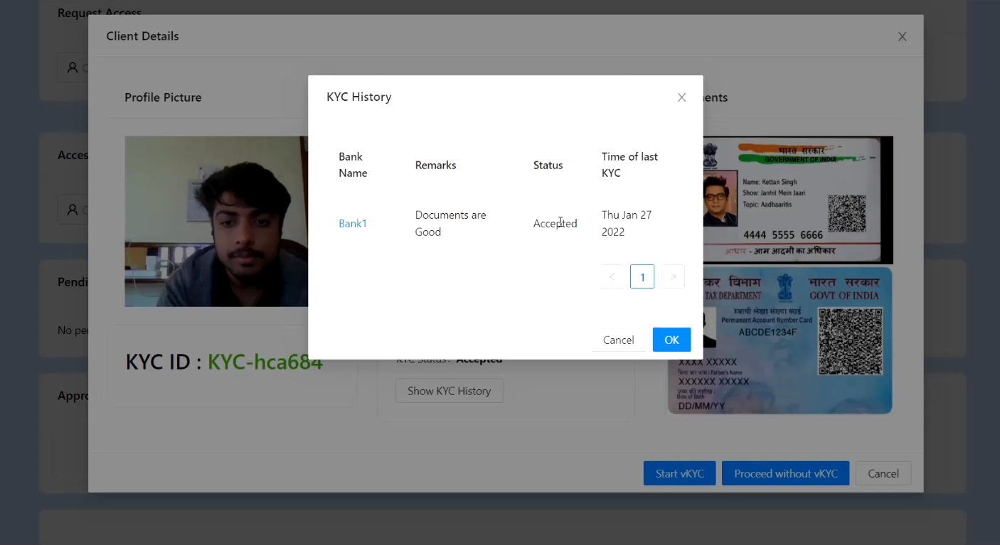

<div align="center">
  <h1>vKYC Chain for a Banking Consortium</h1>
</div>
<br>

<p align="center">
            
</p>


<div align="center">
    <h1>Team: SyntaxError</H1>
    <H3>Ctrl Alt Debt  : 2022 </h3>
    <h3> Theme: vKYC Chain for a Banking Consortium</h3>
    <h3> Team Members: <strong>Sushil Adwe | Chirag Hegde | Ayush Yadav</strong></h3>
    <h3> Indian Institute of Technology, Guwahati </h3>
</div>
<br/>

**Demo** : [Click here](https://i-notes.netlify.app/)


<!-- ABOUT THE PROJECT -->

## **Problem Statement**
Covid-19 Pandemic has triggered a new innovation in the field of KYC called Video KYC (Know Your Customer) - vKYC. Typically a vKYC is done via a weblink which asks the applicant to upload a few digital documents link PAN Card, Aadhaar along with selfie pictures and location of the applicant through GPS & IP address. This is followed by an employee of the financial institution calling the application over a video call to verify the data and documents. However, this process is done by each institution in silos for which the applicant ends up doing vKYC for each institution separately.

Imagine a group of N banks coming together and forming a consortium who agrees to have the same vKYC for all the member banks. They want to develop a blockchain based vKYC platform where the vKYC is done once and is stored in a blockchain and the member banks share this data for their KYC needs. Apply your innovations and develop a blockchain based vKYC platform.
<br>
<br>

## **Our Solution**
Conventional banking and financial institutions spend a substantial part of customer acquisition costs and isolated KYC databases and try to keep them updated and accurate. The overall cost of managing the silo KYC per customer increases because of a lack of transparency, poor control, mistrust, and data duplication. ​

To overcome the problems caused in traditional system we designed a new, efficient and effective KYC processes  which makes use of highly decentralized technologies such as InterPlanetary File System (IPFS) and Ethereum blockchain that allows, through the suggested developed smart contracts, the implementation of multi-party KYC processes on top of blockchains.

Our solution presents a unique trust management platform based on self-sovereign and decentralizes Video-Know-Your-Customer (vKYC) model to enhance customer privacy through consent-based access, featuring regulator governance and helping banks to use trusted and accurate customer data while reducing the customer acquisition costs.​

Moreover, in decentralized  vKYC platform  the vKYC is done once and is stored in a blockchain and the member banks share this data for their KYC needs.
<br/>
<br/>


<!-- USAGE EXAMPLES -->
## **Screenshots**
<div align="center" ><br/>
Start with creating an account on i-Notebook<br/><hr width=600/>
  <br/><br/>
After Account creation user can add create notes<br/><hr width=600/>
  <br/><br/>
Updating a note<br/><hr width=600/>
  <br/>
</div>
<br/>

### **Tech Stack used**

* [Ethereum Smart Contracts](https://ethereum.org/en/developers/docs/smart-contracts/)
* [InterPlanetary File System (IPFS)](https://ipfs.io/)
* [Solidity](https://docs.soliditylang.org/en/v0.8.11/)
* [React.js](https://reactjs.org/)
* [Node.js](https://nodejs.org/)
* [Web3.js](https://web3js.readthedocs.io/en/v1.5.2/getting-started.html)
* [MongoDb](https://www.mongodb.com/)
* [Ganache GUI](https://trufflesuite.com/ganache/)
* [MetaMask](https://metamask.io/)


<br/>

## Step 1. Clone the project
`git clone https://github.com/ayushyadav9/eKYC-Portal`

## Step 2. Install dependencies
```
$ cd eKYC-Portal
$ npm install
```
## Step 3. Start Ganache
Open the Ganache GUI client that you downloaded and installed. This will start your local blockchain instance. You can also use other local blockchains.

## Step 4. Compile & Deploy Election Smart Contract
`$ truffle migrate --reset`
You must migrate the verification smart contract each time your restart ganache.

## Step 5. Configure Metamask
- Unlock Metamask
- Connect metamask to your local Etherum blockchain provided by Ganache.
- Import an account provided by ganache.

## Step 6. Run the Front End Application
`$ npm start`
Visit this URL in your browser: http://localhost:3000

## Step 6. Run the Back End Application
`$ npm run server`
Visit this URL in your browser: http://localhost:5000

